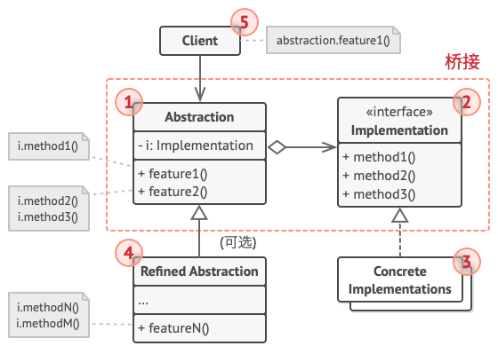

# 桥接模式

> [!WARNING] 理解的不深

[参考文章](https://refactoringguru.cn/design-patterns/adapter)

> 亦称: Bridge

桥接模式是一种[结构型设计模式](../pattern.md#结构型模式)

旨在将一个大类或者一系列的类**抽离为抽象与实现**两个部分, 并在开发时分别使用

## 场景

小宇开发了一款跨平台组件库, 假设现在有 `Button` 和 `Input` 两个组件, 有 `Windows` 和 `Mac` 两个平台

现在根据需求就有4个类, `WindowsButton` 和 `MacButton`, `WindowsInput` 和 `MacInput`

如果需要在添加新的平台或者新的组件时, 会导致类爆炸

## 解决方法

出现上面问题的原因是我们试图在两个维度(平台和组件)上扩展类

桥接模式建议将继承改为**组合**来解决这个问题, 具体来说就是抽取其中一个维度为独立的类层次, 原始类中引用这个类层次的对象, 将具体的工作委派给这个对象

上例中, 我们可以将平台抽取为一个独立的类层次, 组件类中提供引用平台的变量, 将平台相关的工作委派给这个变量, 例如在点击后平台的行为可能有差异

## 结构

> 引用自: https://refactoringguru.cn/design-patterns/adapter

1. 抽象部分 （Abstraction） 提供高层控制逻辑， 依赖于完成底层实际工作的实现对象。

2. 实现部分 （Implementation） 为所有具体实现声明通用接口。 抽象部分仅能通过在这里声明的方法与实现对象交互。抽象部分可以列出和实现部分一样的方法， 但是抽象部分通常声明一些复杂行为， 这些行为依赖于多种由实现部分声明的原语操作。

3. 具体实现 （Concrete Implementations） 中包括特定于平台的代码。

4. 精确抽象 （Refined Abstraction） 提供控制逻辑的变体。 与其父类一样， 它们通过通用实现接口与不同的实现进行交互。

5. 通常情况下， 客户端 （Client） 仅关心如何与抽象部分合作。 但是， 客户端需要将抽象对象与一个实现对象连接起来。

## 贴个代码

<<< @/src/design-pattern/pattern/bridge/bridge.ts
