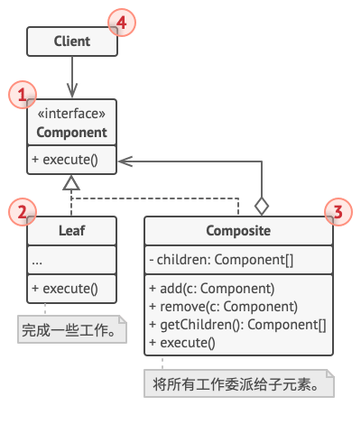

# 组合模式

[参考文章](https://refactoringguru.cn/design-patterns/composite)

> 亦称: 对象树、Object Tree、Composite

组合模式是一种[结构型设计模式](../pattern.md#结构型模式)

旨在将对象组合为树结构, 并能够像使用**独立对象**一样使用它

## 场景

小宇开发一款图形编辑器, 其中, 图形可以任意组合为一个组, 组可以和图形或其他组组合为一个新的组, 当移动组时, 组内所有元素都会移动

所以在移动方法中需要判断当前对象是组还是图形, 如果是图形则移动, 如果是组则递归移动组内所有元素

这样写可以满足需求, 但是不够优雅

那就**重构!!!**

## 解决方法

组合模式需要应用可以被处理为**树结构**

组合模式建议使用一个**通用的接口**来表示组(Composite)和节点(Leaf), 并在该接口中定义一个通用方法(上例中的 `move`)

当前节点是组时, 会将**工作委派**给子节点, 当前节点是节点时, 会直接执行工作

这样客户端在处理时并不需要关心当前的对象是组还是节点, 只需要将工作委派给这个通用接口的子实现类

## 结构

> 引用自: https://refactoringguru.cn/design-patterns/composite

1. 组件 （Component） 接口描述了树中简单项目和复杂项目所共有的操作。

2. 叶节点 （Leaf） 是树的基本结构， 它不包含子项目。 一般情况下， 叶节点最终会完成大部分的实际工作， 因为它们无法将工作指派给其他部分。

3. 容器 （Container）——又名 “组合 （Composite）”——是包含叶节点或其他容器等子项目的单位。 容器不知道其子项目所属的具体类， 它只通过通用的组件接口与其子项目交互。 容器接收到请求后会将工作分配给自己的子项目， 处理中间结果， 然后将最终结果返回给客户端。

4. 客户端 （Client） 通过组件接口与所有项目交互。 因此， 客户端能以相同方式与树状结构中的简单或复杂项目交互。

## 贴个代码

<<< @/src/design-pattern/pattern/composite/composite.ts
