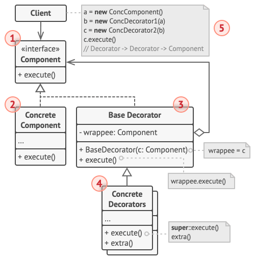

# 装饰器模式

[参考文章](https://refactoringguru.cn/design-patterns/decorator)

> 亦称： 装饰者模式、装饰器模式、Wrapper、Decorator

装饰器模式是一种[结构型设计模式](../pattern.md#结构型模式)

允许通过将对象放入包含行为的特殊对象中来对原对象的**行为进行扩展**

## 场景

小宇开发了一款文件上传工具, 刚开始时只需要将源文件上传到服务器即可, 后面为了保证数据安全, 在上传前需要对文件加密, 读取时需要解密

你可能会想这很简单, 添加一个加密子类就可以, 那如果还需要进行压缩呢, 再添加一个子类吗, 如果只需要压缩呢, 或者需要对视频文件进行转码, 你的子类个数不想打破吉尼斯世界纪录的话还是重构吧

## 解决方法

装饰器模式建议定义一个装饰器接口并添加**对原对象的引用**, 装饰器包含与原对象接口**相同的一系列方法**(上例中的读/写文件的方法), 并将接收到的请求**委派给原对象**, 但是可以在请求的前后对其进行处理(上例中的加密或者压缩)

装饰器中对原对象的引用类型可以是原对象的抽象接口, 那么这样会发生一个很有趣的事情, 我们可以给装饰器添加装饰器([责任链](../chain-of-responsibility/chain-of-responsibility.md)), 在下面代码中会体现

## 结构

> 引用自: https://refactoringguru.cn/design-patterns/decorator

1. 部件 （Component） 声明封装器和被封装对象的公用接口。

2. 具体部件 （Concrete Component） 类是被封装对象所属的类。 它定义了基础行为， 但装饰类可以改变这些行为。

3. 基础装饰 （Base Decorator） 类拥有一个指向被封装对象的引用成员变量。 该变量的类型应当被声明为通用部件接口， 这样它就可以引用具体的部件和装饰。 装饰基类会将所有操作委派给被封装的对象。

4. 具体装饰类 （Concrete Decorators） 定义了可动态添加到部件的额外行为。 具体装饰类会重写装饰基类的方法， 并在调用父类方法之前或之后进行额外的行为。

5. 客户端 （Client） 可以使用多层装饰来封装部件， 只要它能使用通用接口与所有对象互动即可。

## 贴个代码

<<< @/src/design-pattern/pattern/decorator/decorator.ts
