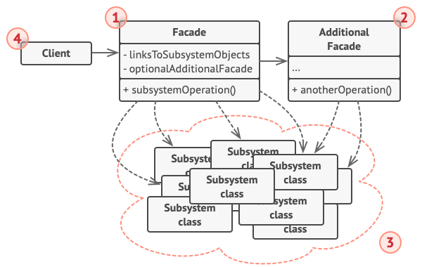

# 外观模式

[参考文章](https://refactoringguru.cn/design-patterns/facade)

> 亦称: Facade(/fəˈsɑːd/), 门面模式

外观模式是一种[结构型设计模式](../pattern.md#结构型模式)

为复杂的子系统提供一个简单的接口

## 场景

小宇开发了一款视频编辑器, 通常这个视频编辑器会有很多的元素存在, 每个元素都是一个独特的类, 他们的构造参数可能各不相同, 这时在创建的时候就会有心智负担, 我们可以使用外观模式来代替我们创建元素

### 一个更加形象的例子

'小爱同学, 关闭房间里所有的灯'

'好的!'

其中智能音响就是外观, 所有的灯就是子系统

## 解决方法

外观模式建议子系统包含到一个名为外观的类中, 并**提供一个简单的接口**, 简化操作子系统的流程

如果你的程序需要与一个包含了许多复杂功能的库整合, 而你只需要使用其中的某一个功能, 那么外观模式此时是非常合适的

## 结构

1. 外观 （Facade） 提供了一种访问特定子系统功能的便捷方式， 其了解如何重定向客户端请求， 知晓如何操作一切活动部件。

2. 创建附加外观 （Additional Facade） 类可以避免多种不相关的功能污染单一外观， 使其变成又一个复杂结构。 客户端和其他外观都可使用附加外观。

3. 复杂子系统 （Complex Subsystem） 由数十个不同对象构成。 如果要用这些对象完成有意义的工作， 你必须深入了解子系统的实现细节， 比如按照正确顺序初始化对象和为其提供正确格式的数据。子系统类不会意识到外观的存在， 它们在系统内运作并且相互之间可直接进行交互。

4. 客户端 （Client） 使用外观代替对子系统对象的直接调用。

## 与[中介者模式](../mediator/mediator.md)的区别

外观模式不约束子系统的行为, 子系统间**可以互相交流**, 子系统对外观**没有感知**(子系统不存在对外观的引用)

中介者模式约束了组件的行为, 组件之间**只能通过中介者进行沟通**, 每个组件都**知道中介者**的存在

## 贴个代码

<<< @/src/design-pattern/pattern/facade/facade.ts
