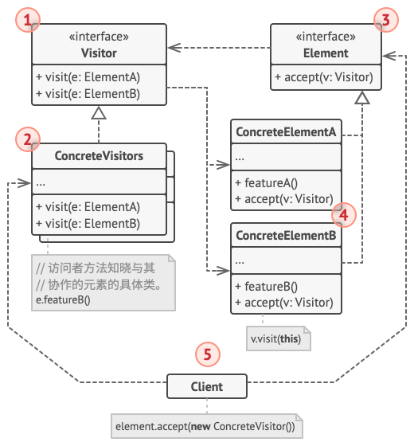

# 访问者模式

[参考文章](https://refactoringguru.cn/design-patterns/visitor)

> 亦称: Visitor

访问者模式是一种[行为型设计模式](../pattern.md#行为型模式)

旨在将算法(行为)与其作用的对象**分离**

## 场景

小宇正在开发一款视频编辑器, 使用者可以在画布中添加视频, 图片等元素, 每一个元素都是一个独立的类

现在需要给每一个元素提供一个下载功能, 这看上去非常很简单, 只需要给每一个元素添加一个下载方法, 然后在需要的地方调用下载方法即可

我们仔细想这个功能, 这些类的主要工作是呈现元素内容, 给它们添加一个下载功能并不合适, 而且假设后面需要其他奇怪的功能, 这些类的代码会变得非常臃肿

## 解决方法

访问者模式建议将新行为**封装到一个名为访问者的类**中, 而**不是试图整合到已有类**中

现在需要将执行新操作的**对象传递给访问者**中的方法, 访问者可以访问对象的一切必要数据

访问者可以**定义一组方法**来处理不同的对象

```ts
class Visitor {
	visit(element: Element): void {}

	visit1(element: Element1): void {}
}
```

现在出现了一个新的问题, 我们应该怎么调用访问者呢?

```ts
for (const element of elements) {
  if(element instanceof Element1){
    visitor.visit1(element)
  } else if {
    // ...
  }
}
```

这样的条件判断当然是行不通的, 这里可以想到使用方法重载, 但是方法重载在这里是行不通的(即使在 `Java` 这种支持方法重载的语言中), 因为方法重载受[静态绑定](./double-dispatch.md#静态前期绑定)的约束, 由于我们无法提前知道对象所属类(在列表中, 我们只知道对象的基类), 所以方法重载无法正确的调用

访问者模式使用了[双分派](./double-dispatch.md#双分派)的技巧, 把**选择权委派给具体类**, 具体类明确知晓自身的类型, 所以能正确的选择调用的方法(即使使用方法重载也可以选择正确)

```ts
class Element1 {
	accept(visitor: Visitor) {
		visitor.visitElement1(this)
	}
}

class Element2 {
	accept(visitor: Visitor) {
		visitor.visitElement2(this)
	}
}
const visitor = new ConcreteVisitor()
```

## 结构

> 引用自: https://refactoringguru.cn/design-patterns/visitor



1. 访问者 （Visitor） 接口声明了一系列以对象结构的具体元素为参数的访问者方法。 如果编程语言支持重载， 这些方法的名称可以是相同的， 但是其参数一定是不同的。

2. 具体访问者 （Concrete Visitor） 会为不同的具体元素类实现相同行为的几个不同版本。

3. 元素 （Element） 接口声明了一个方法来 “接收” 访问者。 该方法必须有一个参数被声明为访问者接口类型。

4. 具体元素 （Concrete Element） 必须实现接收方法。 该方法的目的是根据当前元素类将其调用重定向到相应访问者的方法。 请注意， 即使元素基类实现了该方法， 所有子类都必须对其进行重写并调用访问者对象中的合适方法。

5. 客户端 （Client） 通常会作为集合或其他复杂对象 （例如一个组合树） 的代表。 客户端通常不知晓所有的具体元素类， 因为它们会通过抽象接口与集合中的对象进行交互。

## 贴个代码

<<< @/src/design-pattern/pattern/visitor/visitor.ts
