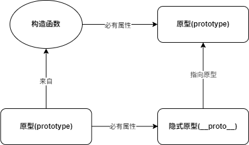
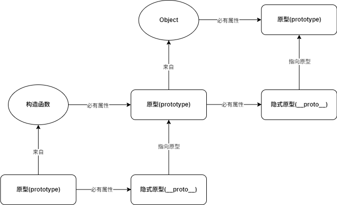
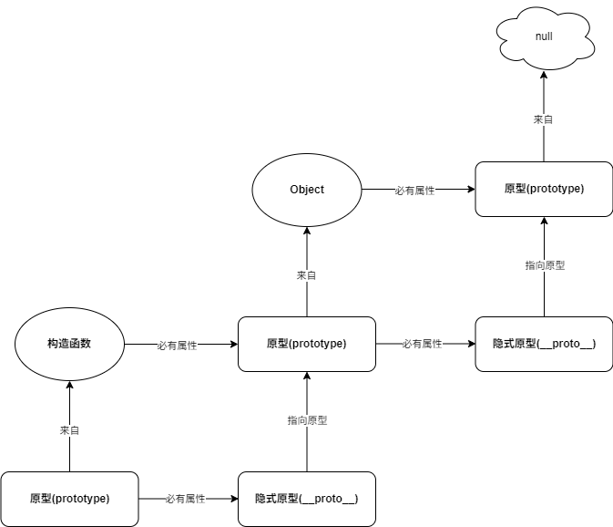
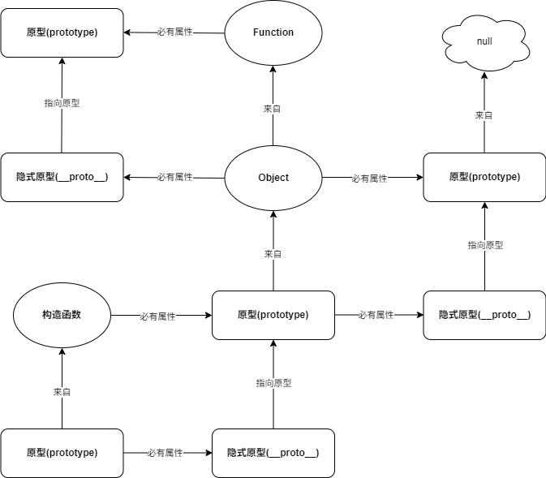
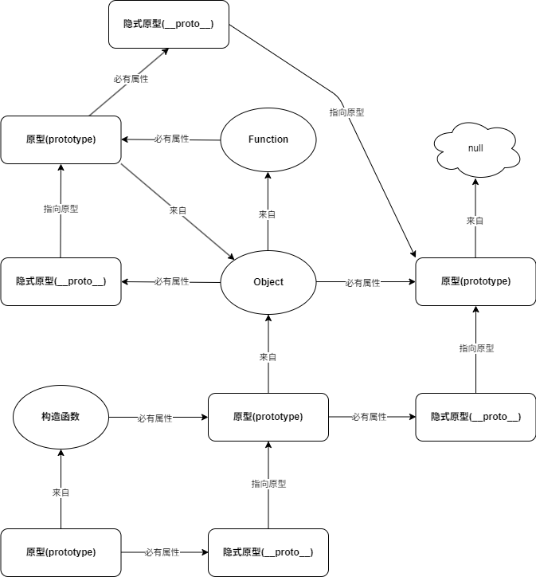
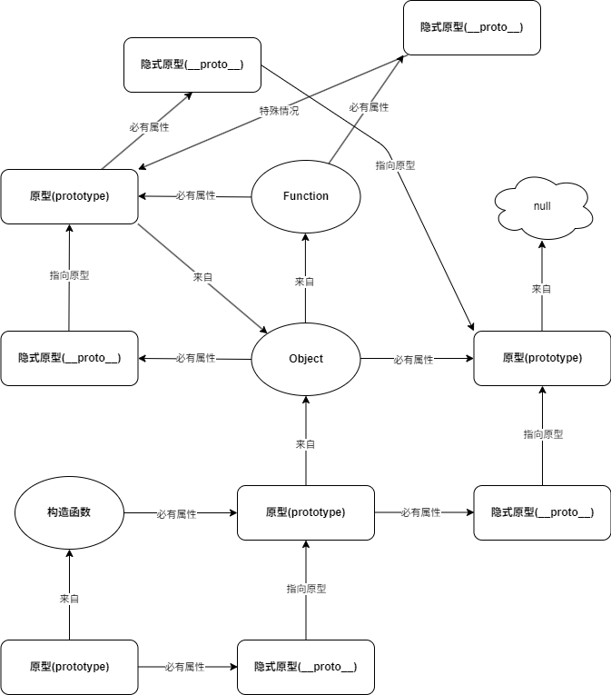
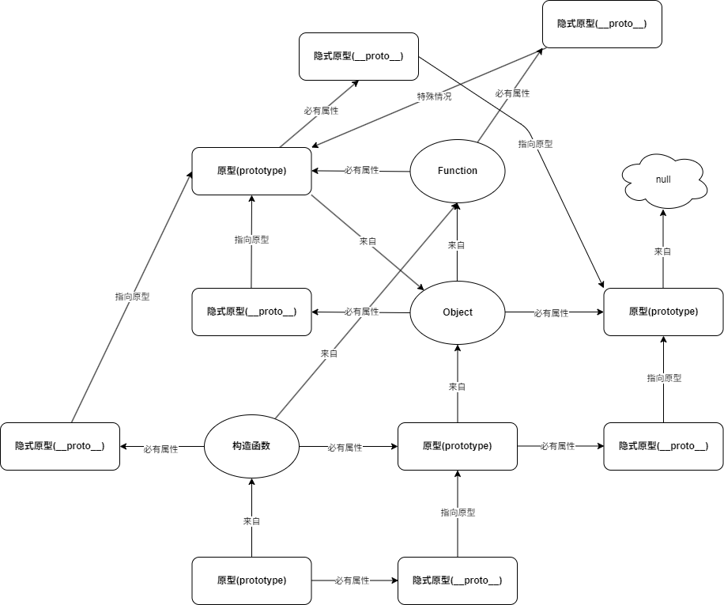

# 原型链

要讨论原型链必须要知道下面的概念

- 构造函数: 所有对象都是通过构造函数创建
- 原型: 所有的函数(箭头函数除外)的 `prototype` 属性
- 隐式原型: 每个对象都有一个隐式原型(\_\_proto\_\_, 不建议直接去访问这个属性, 可以通过 `Object.getPrototypeOf()` 获取)

## 溯源

原型链就是不断地溯源的过程

原型链只有两种特殊情况

1. `Object` 的原型是 `null`
2. `Function` 的隐式原型指向本身

首先实例对象的源头一定是一个构造函数, 构造函数都有一个原型, 实例对象的隐式原型就是这个原型, 这样就得到了第一组关系

原型是一个对象, 所以原型的源头也是一个构造函数, 这个构造函数就是 `Object` (不考虑继承的情况)

`Object` 的原型是一个特殊情况, 为 `null`

`Object` 是一个构造函数, 函数即是对象, 所以 `Object` 的源头是一个构造函数, 这个构造函数就是 `Function`

`Function` 的原型来自 `Object`

`Function` 的来源也是一个特殊情况, `Function`的隐式原型指向他自身的原型

最后, 刚开始的第一个构造函数也是来自于 `Function`, 所以我们就得到了原型图全貌

