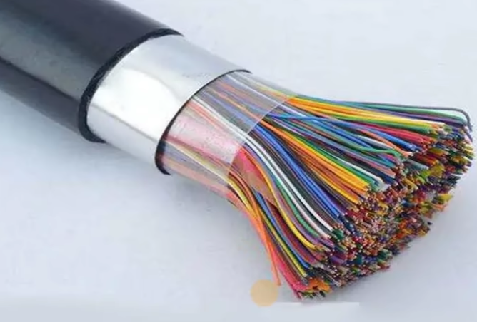
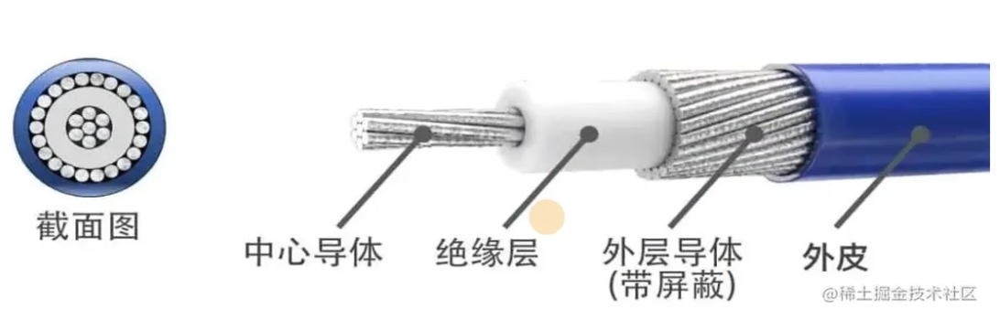

# 七成模型

OSI参考模型和TCP/IP

OSI参考模型是抽象的模型，TCP/IP是具体的实现模型

TCP/IP具体实现是4层模型

1.  网络接口层对应[物理层](#物理层)和[数据链路层](#数据链路层)
2.  网络层对应[网络层](#网络层)
3.  传输层对应[传输层](#传输层)
4.  引用层对应[会话层](#会话层), [表示层](#表示层)和[应用层](#应用层)

TCP/IP具体是多少层有争议, 有的认为物理层和数据链路层不是同一层, 不过无所谓了

## 物理层

IEEE820.1

就是硬件, 网卡网线等

这一层需要传输二进制数据, 单位bit, 所以这一层主要传输比特流

最重要了解物理通信方法 => 信道

### 有线信道

见名知意, 有一条看得见的线连接

#### 明线

电线杆上的电线一类, 老式的物理层, 优点是传输损耗低, 但是容易受外界影响, 逐步被电缆取代

#### 对称电缆

#### 同轴电缆

使用范围极广

#### 光纤

通过反射光来传输, 快! 用的也挺多的

### 无线信道

卫星通信, 广播电台, wifi等

## 数据链路层

FOOO, Ethernet, PPP

通过网卡把比特流合成为帧, 单位数据帧, 再通过广播的形式进行传输

每个网卡对应一个MAC地址, 数据帧会携带这个地址, 这样就知道数据帧是哪一个网卡发出的了

因为是广播, 所以不能把所有的互联网用户都放在一个网段里, 会产生广播风暴, 所以需要将用户放在一个一个小网段中, 在自己的网段中广播不影响其他网段, 所以互联网就是无数个小网段组成的巨型网络

## 网络层

IP, ICMP, ARP, RIP

这一层定义了ip地址

控制数据链路层和传输层之间的信息转发, 决定了数据需要发给谁

这一层叫做数据包

如果是同一个网络则不需要这一层的加入就可以通信, 也就是局域网下不用联网也可以传输数据

### ip

[数据链路层](#数据链路层)中说了互联网是无数个小网段组成的, 其中每个小网段的地址就是ip

所以每台计算机都有两个地址, 一个MAC地址, 一个ip地址

ip确定计算机所在的子网络, 也就是一个小网段, MAC地址确定计算机在子网内的位置

规定ip的协议叫做ip协议, 广泛采用第四版协议, 也就是ipv4, 由于ipv4现在不够用了, 所以现在推广ipv6

### 主要功能

1. 寻址: 通过ip地址找到数据接收方

2. 路由: 寻址的方式, 根据路由器中的路由表, 将数据包发送到正确的ip

## 传输层

TCP, UDP

这一层定义端口号

TCP会进行三次握手四次挥手, 所以TCP是可靠的, 但是速度较慢

UDP不进行三次握手四次挥手, 所以UDP是不可靠, 但是速度快, 常用与直播和游戏

这一层叫做数据段

## 会话层

SSL, TLS

这一层定义了一个机制, 允许发送方和接收方启动或者停止请求会话

包含了一个checkpoint机制来维持可靠回话

这一层经常被叫做报文

不太理解这一层干啥用的

## 表示层

JPEG, ASCII, 加密

对数据进行解码, 解码成计算机能读懂的格式

这一层也叫报文

## 应用层

Http, FTP, SNMP, DNS

便于人类使用的方法, 例如域名系统dns就是便于人类记忆

这一层也叫报文

## 总流程

通过**物理层**来传输数据

既然是传输数据那就需要一个收发的装置, 这个装置就在**数据链路层**

由于数据链路层是通过广播的形式发送, 一个人发送广播所有人都听得到不太现实, 所以这个时候就需要**网络层**

网络层与网路层之间需要通信这个时候就需要**传输层**了

再给传输层定义一个机制, 这个机制就是**会话层**

将传输后的数据翻译成**表示层**数据, 便于计算机理解

需要提供一个**应用层**便于人类使用
