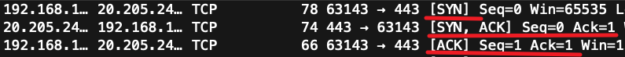
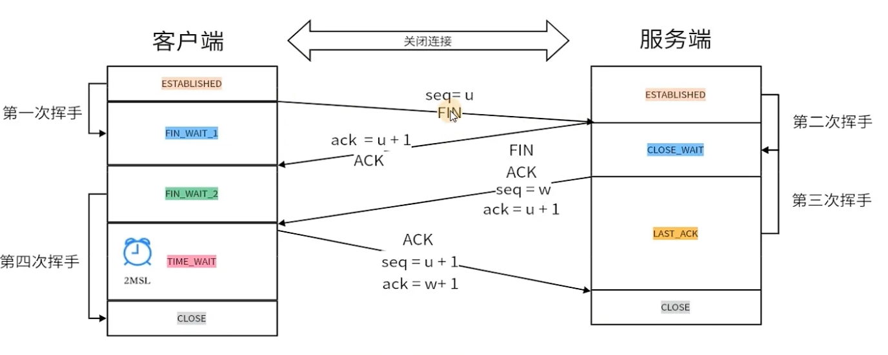

# tcp三次握手与四次挥手

[[toc]]

名词解释

- seq(sequence number): 序列号
- ack(acknowledgment number): 确认号
- ACK(acknowledgment): 确认
- SYN(synchronize): 同步
- FIN(finish): 结束

## 三次握手

建立tcp连接前需要进行三次握手

### 第一次握手

客户端发送seq, seq是通过一个算法得出的, 具体算法不研究

seq = n

### 第二次握手

服务器发送ask和seq, ask是根据第一次握手的seq加1得出的, seq是通过一个算法得出的, 返回标识为SYN和ACK

ask = n + 1 seq = m

### 第三次握手

客户端发送ask和seq, ask是根据第二次握手的seq加1得出的, seq是根据第一次握手的seq加1得出的, 返回标识为ACK

ask = m + 1 seq = n + 1

## 四次挥手

### 第一次挥手

客户端发送seq, seq是通过一个算法得出的, 携带FIN标识

### 第二次挥手

服务端发送ack, ask是根据第一次挥手的seq加1得出的, 携带ACK标识

服务器会在此时处理未完成的任务

### 第三次挥手

服务器发送ask和seq, ask是等于第二次挥手的ack, seq是根据第一次挥手的seq加1得出的, 携带FIN标识

### 第四次挥手

客户端发送ack和seq, ask是根据第三次挥手的seq加1得出的, ask是根据第一次挥手的seq加1得出的, 携带ACK标识

[客户端会等待一段时间(1到4分钟)再关闭连接](###为什么客户端需要等待一段时间再关闭连接)

### 为什么客户端需要等待一段时间再关闭连接

因为第四次挥手可能会断开

如果第四次挥手断开, 服务端在长时间没收到第四次挥手时会重新发送第三次挥手

这时候如果客户端已经关闭了连接, 那么服务端则永远不会收到第四次挥手, 那么连接就会一直存在, 所以客户端需要等待一段时间再关闭连接来防止第四次挥手失败而重试的情况

## 个人思考

存在三次握手四次挥手的理由就是为了保证服务端不会建立错误的连接和不会断不开连接

建立连接的条件是服务端收到一次连接请求后还需要向客户端确认一次来确认连接的正确性, 所以才有三次握手

断开连接的时候也需要客户端等待一段时间再关闭连接

至于为什么有四次挥手, 而不是在收到第一挥手的时候直接断开连接, 是因为在收到断开连接挥手时需要处理未完成任务, 在处理完成后需要再问询一次, 所以一共四次

所以三次握手和四次挥手不管哪一步出现错误都不会存在服务器建立错误连接和断不开连接的情况
