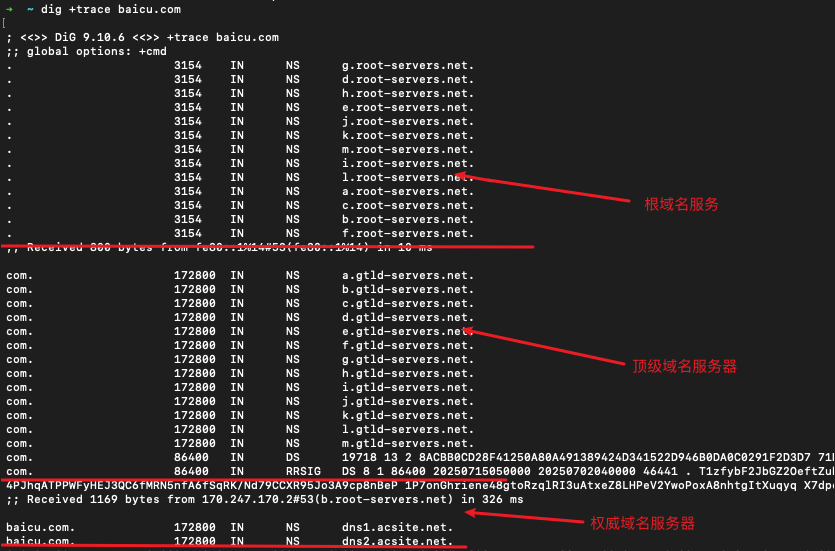
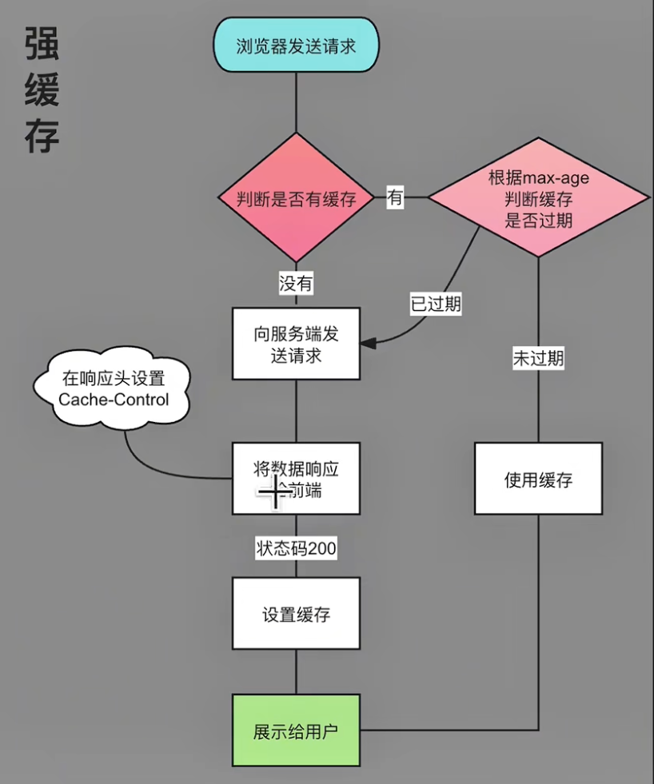
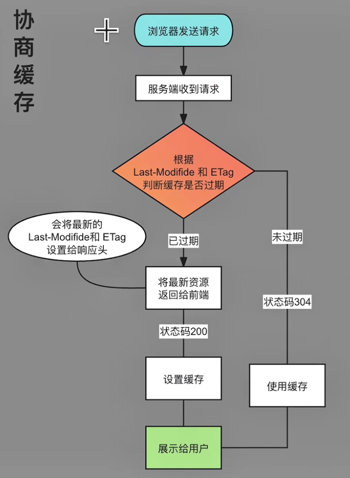

# 访问url都发生了什么

总流程

dns解析 -> 三次握手 -> http请求 -> 请求缓存 -> 四次挥手 -> dom解析 -> css解析 -> 浏览器渲染 -> js解析

## 1. dns解析

首先需要了解dns是什么

dns(domain name system)是域名系统, 解决ip难记的问题

浏览器首先回去查找浏览器缓存: chrome://net-internals/#dns

缓存中没有, 会去找计算机缓存

如果没有则会找本地hosts文件, 使用switchhosts可以查看本地hosts文件

还没有的话就会向域名服务器发送网络请求

域名服务器会按照 本都dns服务器 -> 跟域名服务 -> 顶级域名服务器 -> 权威域名服务器 的规则查找

通过`dig +trace baidu.com`命令可以查看查找规则



这样就可以获取到域名的ip了

## 2. 三次握手

[详情](../TCP/TCP.md#三次握手)

## 3. http请求

http请求方式除了常见的get和post还有put, delete, head, options, patch等

发送http请求的时候有一些特殊请求会先发送预检请求(option)

情况1: 如果请求跨域了, 那么浏览器会先发送一次option请求, 服务器如果允许了当前请求, 那么就发送一个正常的请求, 如果服务器拒绝了则浏览器会阻止该请求

情况2: 非简单请求会发送预检请求

非简单请求的条件(任一满足):

1. 非简单请求方法（如PUT、DELETE、PATCH等）
2. 自定义请求头(如Authorization、Content-Type: application/json等)
3. Content-Type非简单值（如text/plain、multipart/form-data、application/x-www-form-urlencoded以外的类型）

## 4. 请求缓存

强缓存和协商缓存的区别就在于强缓存的判断位置在客户端, 协商缓存的判断位置在服务端

### 强缓存



触发强缓存的条件: 服务器在响应头里设置`Cache-Control: max-age=<anytime>`anytime单位为秒或者`Expires: <date>`(如果两个都存在, 则`Cache-Control`优先级更高), 浏览器会自动根据时间判断是否使用缓存结果

```js
// nodejs
// ...
res.setHeader('Cache-Control', 'max-age=1000')
```

在network选项卡中, http状态码旁会显示缓存方式

200 (from disk cache) 或者 200 (from memory cache)

分别是硬盘缓存和内存缓存, 都属强缓存, 如果内存缓存有则直接读取内存缓存, 就不会在读取硬盘缓存

强缓存的特点是如果有缓存结果则不会经过服务器

### 协商缓存



服务器在响应头里返回`etag`和`last-modified`标识

客户端每次都会发送`etag`和`last-modified`标识到服务器, 服务器通过这两个标识来判断是否使用缓存

如果使用缓存, 则返回304状态码, 如果不使用, 则返回新的`etag`和`last-modified`标识

协商缓存每次一次都会发送请求到服务器, 把使不使用缓存的判断交给服务器

## 5. 四次挥手

[详情](../TCP/TCP.md#四次挥手)

## 6. dom解析

html解析器将html文件转换成dom树

## 7. css解析

css渲染器将css文件转换成cssom树, 再进行样式计算等操作

## 8. 浏览器渲染

### 回流(Reflow)

对元素几何属性的修改或者访问会引起全部或者部分页面重新绘制

没错, 访问也会, 例如获取元素的offsetWidth的属性会引起页面回流

### 重绘(Repaint)

对元素的颜色信息的修改会引起全部或者部分页面重新绘制

## 10. js解析

不讨论
