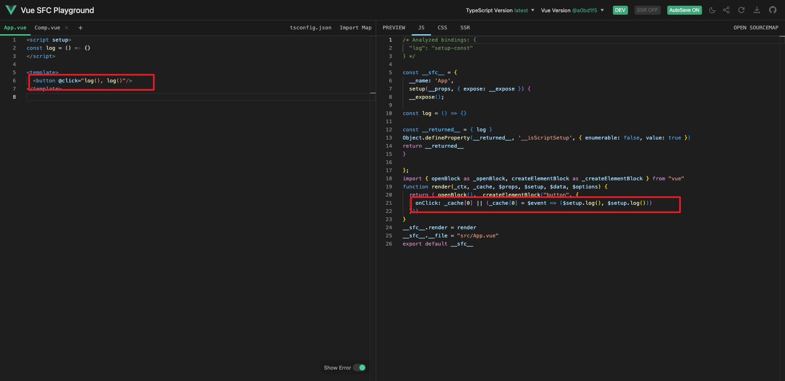
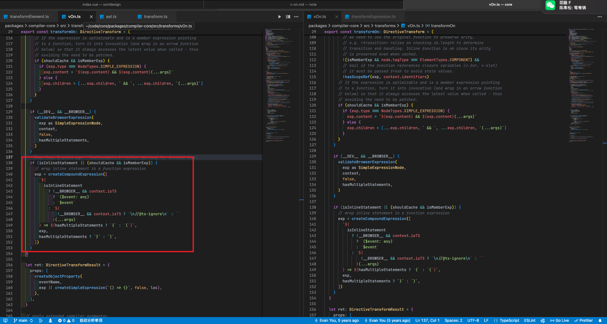

# v-on的思考

某位面试官为了一个问题, v-on可以绑定几个函数

正常来想, v-on不是只一个函数吗, 还可以绑定多个?

正确答案: 无数个

```vue
<div @click="handle1(), handle2(), handle3() ..."></div>

<!-- or -->

<div @click="[handle1(), handle2(), handle3()]"></div>

<!-- but 上面的方法中不写括号是不行的 -->
```

为什么会成这样的问题呢?

## 看文档

[文档上说](https://cn.vuejs.org/api/built-in-directives.html#v-on)

```md
v-on​

给元素绑定事件监听器。

缩写：@

期望的绑定值类型：`Function | Inline Statement | Object (不带参数)`
```

类型中的 Function可以理解, 就是最常用的直接传递函数

Object类型主要指的是一个v-on绑定多个事件(不常用)

```vue
<!-- 对象语法 -->
<button v-on="{ mousedown: doThis, mouseup: doThat }"></button>
```

那么这个`Inline Statement`是个什么类型, 这也是这里主要探讨的地方

## 看编译

[详情](https://play.vuejs.org/#eNp9ks1uwjAQhF/F8oVEQuTQnlBAbRGV2kOL2t4wh9RZgiGxLXtNkVDevbZTfqoWbuudbzczsff0XuvB1gEd0txyIzQSC+j0mEmupEVSq4qMSJKS0ZjsWybzrMM84A8Ija4LBH8iJP90iEqSO14Lvhkx6meTtB9WJCmj2UUoIgfgLzE/37PouDw7+zTtU7Te7lJUg7VV0ofZh1WMctVoUYN51Sh8HEaHJCpBK+pafT3HHhoH/UOfr4Bv/umv7S70GJ0ZsGC2wOhRw8JUgJ08fX+Bna+PYqNKV3v6ivgGVtUueOywBydLb/uMi26fGq0MCll92OkOQdpDqGA0kG3kGfU3OrkS/WT3ZnAb55hs/V8MMxdeQ6BKWAoJM6O0TX52KTlZFbKCIXl0kscAYV0aBk4j00agTeY9HtnewsvX3lEptl2RddXvy26/AQoJ5Iw=)



```vue
<div @click="handle1(), handle2(), handle3() ..."></div>
```

```js
// 完整编译结果, 后面省略重复部分 // [!code focus]
_createElementVNode("button", {
  onClick: _cache[0] || (_cache[0] = $event => ($setup.handle1(), $setup.handle2(), $setup.handle3())) // [!code focus]
}),
```

其实 `<div @click="handle1(), handle2(), handle3() ..."></div>` 就是上面的 `Inline Statement` 类型

编译器会将 `handle1(), handle2(), handle3() ...` 当作一个语句, 然后再触发事件是运行这个语句

数组写法同理

```vue
<div @click="[handle1(), handle2(), handle3()]"></div>
```

```js
// 数组编译结果
;($event) => [$setup.handle1(), $setup.handle2(), $setup.handle3()]
```

甚至可以在里面写任何东西

```vue
<div @click="{ handle1 }"></div>
```

```js
// 编译结果
;($event) => ({ handle1: $setup.handle1 })
```

这也解释了为什么不加括号不生效的原因, 因为当这个事件触发时, 语句运行了, 但是函数因为没有括号而没有被调用

```js
// 无括号编译结果
;($event) => ($setup.handle1, $setup.handle2, $setup.handle3)
```

为什么编译后的结果是这样的呢

## 看源码



差不多的意思就是说, 如果判断出来是一个`inline statement`, 那么就拼接一个函数, `inline statement`就是函数体

顺便一提, `inline statement` 支持多行, 意思就是说, 这里可以写分号, 编译出来就是多行

```vue
<!-- prettier-ignore -->
<div @click="handle1(); handle2(); handle3()"></div>
```

```js
// 编译结果
// prettier-ignore
;$event => {$setup.log(); $setup.log()}
```

## 思考

所以为什么如果只传函数的话可以加括号也可以不加

因为如果加了括号就是一个`inline statement`

```js
;($event) => $setup.handle1()
```

如果不加括号就是一个函数, 会把这个函数直接传递个事件

```js
_createElementVNode('button', { onClick: $setup.log })
```
